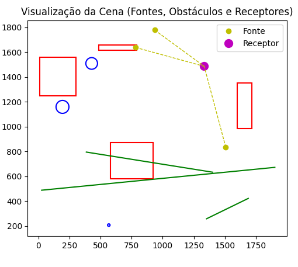
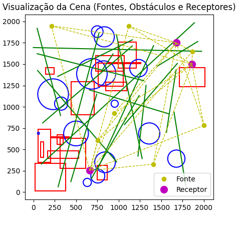
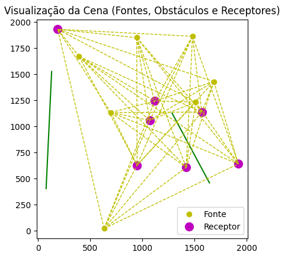
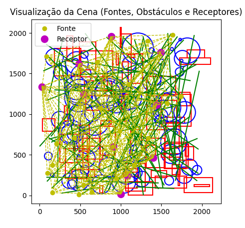

# 🔥 Firepot-Challenge

**Simulador de Luminosidade**

Este projeto simula a **intensidade luminosa** recebida por pontos receptores em um plano 2D contendo **fontes de luz** e **obstáculos**.  
O cálculo considera **interseções geométricas** e **reduções de intensidade** conforme a opacidade de cada obstáculo.

---

## Estrutura do Projeto

├── include/
│ ├── geometry.h # Estruturas e classes geométricas (retângulo, círculo, linha)
│ ├── parser.h # Declaração do parser e estrutura da cena
│ ├── simulation.h # Funções de simulação
│
├── src/
│ ├── geometry.cpp # Implementação dos cálculos geométricos
│ ├── parser.cpp # Interpretação do arquivo de entrada
│ ├── simulation.cpp # Lógica de propagação de luz
│ ├── export_scene.cpp # Exportação da cena para visualização
│ ├── main.cpp # Ponto de entrada do programa
│
├── plot_scene.py # Script opcional de visualização
├── regiao.txt # Arquivo de entrada (exemplo de cena)
├── scene_debug.txt # Arquivo auxiliar gerado automaticamente
└── README.md

---

## Compilação e Execução

### **Windows**

Abra o terminal na pasta do projeto e execute:

```bash
g++ src/*.cpp -Iinclude -o teste
teste.exe

### Linux / macOS
bash
Copiar código
g++ src/*.cpp -Iinclude -o teste
./teste
O programa lerá o arquivo regiao.txt e exibirá os resultados no formato:

makefile
Copiar código
P0 = 1499.44
P1 = 2239.97
...
 Visualização Gráfica (Opcional)
Você pode visualizar a cena exportada com o script Python:

bash
Copiar código
python plot_scene.py
Legenda
🟡 Fonte – origem da luz

🟣 Receptor – ponto onde a iluminação é medida

🟥 Retângulo, 🔵 Círculo, 🟩 Linha – obstáculos com redução de luz

Linhas tracejadas amarelas representam a conexão visual entre fontes e receptores

Formato do Arquivo de Entrada (regiao.txt)
Cada linha define um elemento da cena:

Tipo	Significado	Parâmetros
R	Retângulo	id redução x y altura largura
C	Círculo	id redução x y raio
L	Linha	id redução x1 y1 x2 y2
F	Fonte de luz	id intensidade x y
P	Receptor	id x y

Exemplo:
L 0 11 1689 422 1353 258
C 2 26 566 207 10
R 5 16 8 1248 310 294
F 1 325.69 935 1778
P 0 1334 1486

Modelo de Atenuação Luminosa

A simulação utiliza um modelo de atenuação progressiva baseado na quantidade de interseções entre o raio de luz e os obstáculos.

Para cada fonte F e ponto P:

I_total(P) = Σ [ I_fonte × (1 - r/100)^n ]


Onde:

I_total(P) → iluminação total no ponto receptor

I_fonte → intensidade original da fonte

r → fator de redução do obstáculo (em %)

n → número de interseções detectadas entre F e P

🔹 O resultado é acumulativo para todas as fontes e arredondado para duas casas decimais.

Funcionamento
Cada fonte de luz emite uma intensidade inicial.

Para cada ponto receptor:

O algoritmo verifica se o segmento entre a fonte e o ponto cruza obstáculos.

A cada interseção, aplica-se um fator de redução proporcional ao valor de reduction.

O resultado final é a soma das intensidades atenuadas de todas as fontes.

Tratamento de Erros
Linhas inválidas no arquivo são ignoradas com aviso.

O programa não encerra caso encontre erros de leitura.

Caso regiao.txt não exista, uma mensagem é exibida.

A saída final é limpa e direta, contendo apenas os valores calculados.

Exemplos de Execução
🔹 Entrada 1


R 0 65 116 1221 121 81
C 1 25 1106 1711 168
C 2 73 1456 1650 152
R 3 39 162 721 258 139
R 4 53 605 1791 236 155
F 1 934.83 1253 786
P 0 1364 1860
Saída esperada:
P0 = 68.15
Imagem ilustrativa:


🔹 Entrada 2

L 0 11 1689 422 1353 258
L 1 76 1903 672 25 488
C 2 26 566 207 10
C 3 51 428 1509 47
L 4 82 385 795 1402 633
R 5 16 8 1248 310 294
R 6 86 484 1614 45 307
R 7 30 581 580 291 340
R 8 93 1601 987 364 118
C 9 95 193 1159 52
F 1 325.69 935 1778
F 2 626.40 780 1638
F 3 547.35 1508 833
P 0 1334 1486
Saída esperada:
P0 = 1499.44
Imagem ilustrativa:


🔹 Entrada 3
L 0 31 95 329 1889 1985
L 1 48 1162 1785 285 1355
L 2 34 680 157 1241 1131
C 3 36 633 113 48
L 4 15 45 1622 1294 1306
L 5 55 1786 82 1650 936
C 6 89 954 1036 42
C 7 22 1359 687 124
C 8 59 823 1394 144
R 9 82 751 141 173 113
C 10 45 1677 392 101
C 11 67 326 1037 77
R 12 100 165 394 89 366
R 13 63 872 1504 12 386
L 14 87 1227 422 1322 1251
L 15 32 975 1842 1276 393
R 16 10 848 1189 101 250
L 17 25 935 1619 815 1441
L 18 4 743 1147 440 122
R 19 23 277 557 115 73
L 20 73 1589 917 658 1198
R 21 99 55 347 387 145
L 22 92 45 1919 319 898
R 23 73 312 277 354 304
C 24 48 756 188 82
L 25 55 1 1694 1973 1650
R 26 25 212 636 13 206
R 27 97 1714 1238 220 300
C 28 85 832 1820 118
R 29 62 997 1454 302 208
C 30 36 232 1147 180
C 31 15 1233 1452 103
R 32 48 444 909 384 268
C 33 31 687 1386 179
L 34 89 770 1864 291 62
L 35 68 1561 701 1674 1433
L 36 29 50 1425 977 354
L 37 29 1453 1476 1928 1765
R 38 52 143 1385 72 99
R 39 11 85 407 183 34
R 40 99 23 11 326 356
C 41 74 60 689 12
C 42 84 750 1881 68
C 43 20 841 349 121
L 44 82 110 811 1161 1714
L 45 51 750 262 1410 1716
R 46 19 763 1244 268 290
C 47 93 501 687 145
L 48 51 1069 792 1689 1508
R 49 53 733 1420 181 335
F 1 620.65 756 608
F 2 652.72 212 1949
F 3 841.90 947 925
F 4 124.38 1407 327
F 5 480.66 2000 781
F 6 849.60 1865 1648
F 7 959.06 1120 1946
P 0 1860 1500
P 1 662 253
P 2 1676 1750

Saída esperada:
P0 = 1061.50
P1 = 1219.91
P2 = 978.43
Imagem ilustrativa:


🔹 Entrada 4

L 0 76 1643 460 1285 1128
L 1 91 78 406 131 1527
F 1 697.18 633 23
F 2 705.24 394 1670
F 3 686.28 1685 1430
F 4 528.55 1480 1864
F 5 34.16 946 1851
F 6 496.01 698 1134
F 7 65.94 1510 1234
P 0 189 1931
P 1 1070 1059
P 2 1420 608
P 3 1118 1245
P 4 950 630
P 5 1920 642
P 6 1570 1138
Saída esperada:
P0 = 3213.36
P1 = 3213.36
P2 = 2239.97
P3 = 3213.36
P4 = 2641.67
P5 = 1770.55
P6 = 2683.50
Imagem ilustrativa:


🔹 Entrada 5

L 0 76 1643 460 1285 1128
L 1 91 78 406 131 1527
F 1 697.18 633 23
F 2 705.24 394 1670
F 3 686.28 1685 1430
F 4 528.55 1480 1864
F 5 34.16 946 1851
F 6 496.01 698 1134
F 7 65.94 1510 1234
P 0 189 1931
P 1 1070 1059
P 2 1420 608
P 3 1118 1245
P 4 950 630
P 5 1920 642
P 6 1570 1138
Saída esperada:
P0 = 3213.36
P1 = 3213.36
P2 = 2239.97
P3 = 3213.36
P4 = 2641.67
P5 = 1770.55
P6 = 2683.50
Imagem ilustrativa:



👨‍💻 Autor
Desenvolvido por Arthur Aguiar
📅 2025 — Projeto de simulação geométrica e física da luz
```
