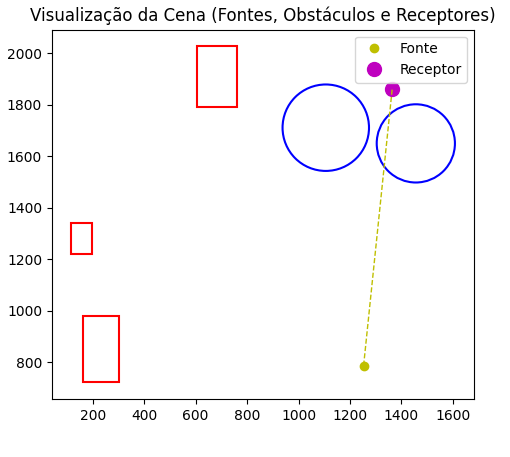

# 🔥 Firepot-Challenge

**Simulador de Luminosidade**

Este projeto simula a **intensidade luminosa** recebida por pontos receptores em um plano 2D contendo **fontes de luz** e **obstáculos**.  
O cálculo considera **interseções geométricas** e **reduções de intensidade** conforme a opacidade de cada obstáculo.

---

## 📁 Estrutura do Projeto

```text
├── include/
│   ├── geometry.h        # Estruturas e classes geométricas (retângulo, círculo, linha)
│   ├── parser.h          # Declaração do parser e estrutura da cena
│   ├── simulation.h      # Funções de simulação
│
├── src/
│   ├── geometry.cpp      # Implementação dos cálculos geométricos
│   ├── parser.cpp        # Interpretação do arquivo de entrada
│   ├── simulation.cpp    # Lógica de propagação de luz
│   ├── export_scene.cpp  # Exportação da cena para visualização
│   ├── main.cpp          # Ponto de entrada do programa
│
├── plot_scene.py         # Script opcional de visualização
├── regiao.txt            # Arquivo de entrada (exemplo de cena)
├── scene_debug.txt       # Arquivo auxiliar gerado automaticamente
└── README.md
```

---

## ⚙️ Compilação e Execução

### 🪟 **Windows**

g++ src/\*.cpp -Iinclude -o teste
teste.exe

````

### 🐧 **Linux / macOS**

```bash
g++ src/*.cpp -Iinclude -o teste
./teste
````

O programa lerá o arquivo `regiao.txt` e exibirá os resultados no formato:

```text
P0 = 1499.44
P1 = 2239.97
...
```

---

## 🔍 Visualização Gráfica (Opcional)

Você pode visualizar a cena exportada com o script Python:

```bash
python plot_scene.py
```

**Legenda:**

- 🟡 **Fonte** – origem da luz
- 🟣 **Receptor** – ponto onde a iluminação é medida
- 🟥 **Retângulo**, 🔵 **Círculo**, 🟩 **Linha** – obstáculos com redução de luz
- Linhas tracejadas amarelas representam a conexão entre fontes e receptores

---

## 📄 Formato do Arquivo de Entrada (`regiao.txt`)

Cada linha define um elemento da cena:

| Tipo | Significado  | Parâmetros                        |
| ---- | ------------ | --------------------------------- |
| `R`  | Retângulo    | id redução x y **altura largura** |
| `C`  | Círculo      | id redução x y raio               |
| `L`  | Linha        | id redução x1 y1 x2 y2            |
| `F`  | Fonte de luz | id intensidade x y                |
| `P`  | Receptor     | id x y                            |

---

## 🧮 Funcionamento

Cada fonte emite uma intensidade inicial.  
Para cada ponto receptor:

1. O algoritmo verifica se o segmento entre a fonte e o ponto cruza obstáculos.
2. A cada interseção, aplica-se um fator de redução proporcional ao valor de `reduction`.
3. O resultado final é a soma das intensidades atenuadas de todas as fontes.

---

## 🧠 Modelo Matemático da Iluminação

A intensidade \( I_p \) recebida em um ponto receptor é calculada pela soma das intensidades de todas as fontes após as reduções causadas pelos obstáculos:

\[
I*p = \sum*{i=1}^{N} \left( I*i \times \prod*{j=1}^{M_i} (1 - r_j) \right)
\]

Onde:

- \( I*i \) → intensidade inicial da fonte de luz \_i*
- \( r*j \) → fração de redução do obstáculo \_j* (exemplo: 0.25 para 25%)
- \( M*i \) → número de obstáculos que afetam a luz entre a fonte \_i* e o ponto receptor
- \( N \) → número total de fontes de luz

Se o caminho entre uma fonte e o ponto não for bloqueado, a luz chega sem atenuação.

---

## 🧩 Exemplos de Execução

### 🔹 **Entrada 1**

<div style="display: flex; align-items: center; justify-content: space-between;">
<pre>

R 0 65 116 1221 121 81
C 1 25 1106 1711 168
C 2 73 1456 1650 152
R 3 39 162 721 258 139
R 4 53 605 1791 236 155
F 1 934.83 1253 786
P 0 1364 1860

Saída esperada:
P0 = 68.15

</pre>

</div>

---

### 🔹 **Entrada 2**

<div style="display: flex; align-items: center; justify-content: space-between;">
<pre>

L 0 11 1689 422 1353 258
L 1 76 1903 672 25 488
C 2 26 566 207 10
C 3 51 428 1509 47
L 4 82 385 795 1402 633
R 5 16 8 1248 310 294
R 6 86 484 1614 45 307
R 7 30 581 580 291 340
R 8 93 1601 987 364 118
C 9 95 193 1159 52
F 1 325.69 935 1778
F 2 626.40 780 1638
F 3 547.35 1508 833
P 0 1334 1486

Saída esperada:
P0 = 1499.44

</pre>

</div>

---

### 🔹 **Entrada 3**

<div style="display: flex; align-items: center; justify-content: space-between;">
<pre>
... (entrada longa omitida)

Saída esperada:
P0 = 1061.50
P1 = 1219.91
P2 = 978.43

</pre>

</div>

---

### 🔹 **Entrada 4**

<div style="display: flex; align-items: center; justify-content: space-between;">
<pre>
L 0 76 1643 460 1285 1128
L 1 91 78 406 131 1527
F 1 697.18 633 23
F 2 705.24 394 1670
F 3 686.28 1685 1430
F 4 528.55 1480 1864
F 5 34.16 946 1851
F 6 496.01 698 1134
F 7 65.94 1510 1234
P 0 189 1931
P 1 1070 1059
P 2 1420 608
P 3 1118 1245
P 4 950 630
P 5 1920 642
P 6 1570 1138

Saída esperada:
P0 = 3213.36
P1 = 3213.36
P2 = 2239.97
P3 = 3213.36
P4 = 2641.67
P5 = 1770.55
P6 = 2683.50

</pre>

</div>

---

## 👨‍💻 Autor

Desenvolvido por **Arthur Aguiar**  
📅 2025 — Projeto de simulação geométrica e física da luz
